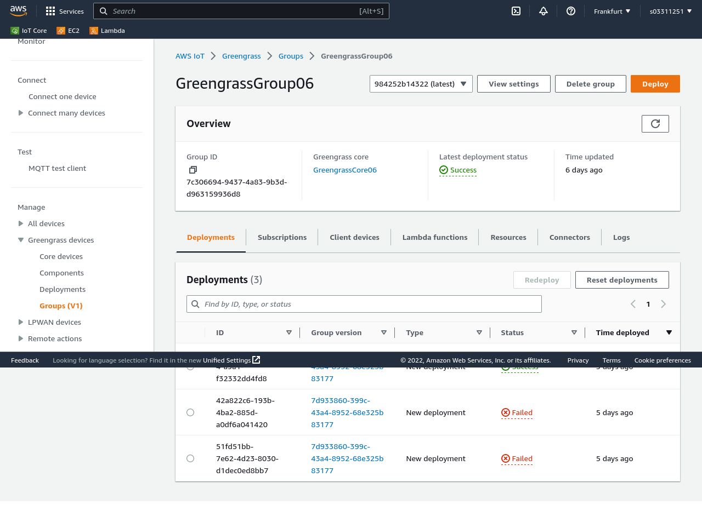
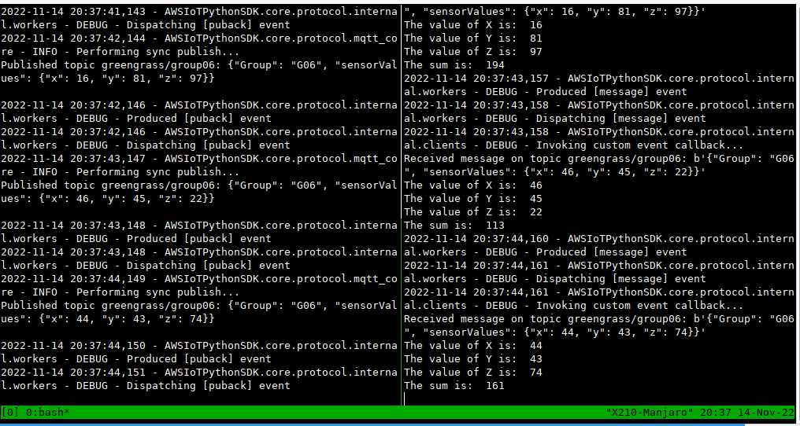

# Don't read me

## Milestone 1

### Assignment

* Screenshots
  * Greengrass group  
    
  * Message publish & subscribe  
    

* Greengrass is an Edge or cloud computing service? Explain briefly your answer.
  * an edge computing runtime & a cloud service
  * consist of:
    * a edge runtime running on Greengrass core device
      * supposed to be placed physically close to the IoT devices
      * with fast & stable connection with IoT devices
      * for quick, immediate & real-time responses
    * a cloud service
      * for configuration & authentication of Greengrass devices

* How many cores can a Greengrass group have?
  * exactly 1.

* Complete the blank spaces in the figure to describe the basic architecture of AWS Greengrass and explain each element.
  * Edge
    * Device
    * MQTT
    * Greengrass core
    * Device
  * IoT Core

* What type of protocols are used by AWS Greengrass in order to secure the communication between the devices?
  * Reference: <https://docs.aws.amazon.com/greengrass/v1/developerguide/gg-sec.html>
  * 
  * HTTPS
    * with TLS for secure communication
    * between AWS IoT services & devices
    * also there is authentication with the cloud IoT core using the X.509 certificates
  * MQTT with TLS
    * between core device and devices, and between AWS IoT Core and core device

* What are the private and public keys? Explain briefly how they are used in the system.
  * used in asymmetric cryptography
  * Private key: Secretly stored in a device
  * Public key: can be shared to other devices
  * The principle is that D_1(E_2(M)) = D_2(E_1(M)) = M, where M is a message, E_1 & E_2 are encryption with a private key & public key respectively, and D_1 & D_2 are decryption with a private key & public key respectively
  * In Greengrass, they are used when:
    * a Greengrass Core authenticates TLS handshake with a AWS IoT core
    * authenticate TLS handshare for MQTT connections
    * encrypt local data

* What happens if you don't have these certificates (keys) in your folder where the basicDiscovery.py file is?
  * Running basicDiscovery.py requires the certificates in the arguments
  * If trying to run basicDiscovery.py with wrong certificates, it will give error messages:
    * Incorrect CA cert.: [X509: NO_CERTIFICATE_OR_CRL_FOUND] no certificate or crl found (_ssl.c:4123)
    * Incorrect device cert.: [SSL] PEM lib (_ssl.c:3874)
    * Because basicDiscovery.py trys to authenticate with cloud IoT Greengrass service at the beginning, but it failed due to the absense of the certificates.

* What is the root-ca certificate that you have in the devices folder?
  * a public key certificate that identifies a publicly-known root certificate authority (CA)
  * basis of an X.509 certificate
    * each X.509 cert. is hashed by a CA, and can be verified with the root-CA cert.

* What types of elements can be chosen from the AWS IoT console when you create a new subscription in a greengrass group.
  * for each subscription we can choose a source, a target and Greengrass topic(s).
    * source / target: a lambda function, a service, a client device or a connector
    * Greengrass topics: formatted with a 'topic filter'

* What are the Greengrass topics?
  * They are MQTT topics
    * a string that serves as an identifier for MQTT messages
    * device can publish & subscribe messages with particular topics that it desires

* Can a device act as publisher and subscriber in different GG topics? If yes, how?
  * Yes
  1. add new subscriptions in AWS console
     * set the device as a source with a topic in a sub., but as a target with another topic in another sub.
  2. run a local programme in the device (e.g., basicDiscovery.py) that publish & subscribe the topics at the same time

* Can multiple devices be subscribed to the same publisher? If yes, how?
  * Yes
  1. add new subscriptions in AWS console, with these devices set as the targets, and set the source as the same publisher
  2. run a local programme on these devices that subscribe for the topics from the publisher.

* What is the discovery service?
  * Reference: <https://docs.aws.amazon.com/greengrass/v1/developerguide/gg-discover-api.html>
  * a cloud service
  * a Greengrass client device always starts the discovery before connecting to the Greengrass core
  * The service provide necessary information for communication with the Greengrass core, e.g.:
    * The group(s) to which the device belongs
    * The IP address and port for the Greengrass core in the group
    * The group CA certificate, which can be used to authenticate the Greengrass core device.

* Why do you need to specify your aws end point while running the discovery service?
  * The service is provided by an AWS cloud server
  * the 'end point' informs the the device where the AWS cloud server is

### Presentation

* Reference: <https://docs.aws.amazon.com/greengrass/v1/developerguide/module1.html>

* Install AWS Greengrass Core V1 on EC2 virtual machine and set up the network settings (Module 1)

* Create 1 Greengrass Core (GreengrassCore06) & 2 Greengrass Device (PublisherG06 & SubscriberG06) under AWS IoT Things <https://eu-central-1.console.aws.amazon.com/iot/home?region=eu-central-1#/thinghub>; all Things come with certificates and I've put those in the OneDrive folder above (Module 2, 4)

* Create 1 Greengrass Group V1 (GreengrassGroup06) and put the 3 Things above inside. <https://eu-central-1.console.aws.amazon.com/iot/home?region=eu-central-1#/greengrass/groups/7c306694-9437-4a83-9b3d-d963159936d8> (Module 2)

* Set up the MQTT topic subscription of greengrass/group06 <https://eu-central-1.console.aws.amazon.com/iot/home?region=eu-central-1#/greengrass/groups/7c306694-9437-4a83-9b3d-d963159936d8/subscriptions> (Module 2)

* Get `basicDiscovery.py` from <https://docs.aws.amazon.com/greengrass/v1/developerguide/IoT-SDK.html>
  * copy certificates into the same folder as `basicDiscovery.py`
  * edit main function for MQTT publication on the message being published
  * edit `def customOnMessage()` for MQTT subscription callback, which would decode the message into a list of x, y & z
